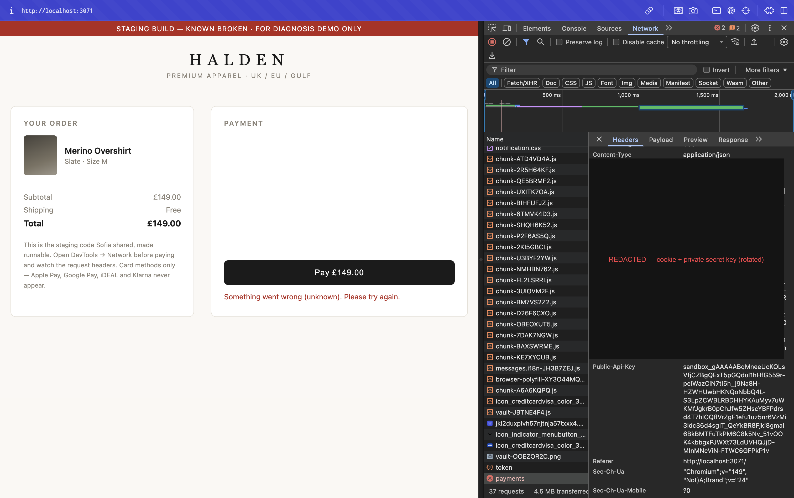
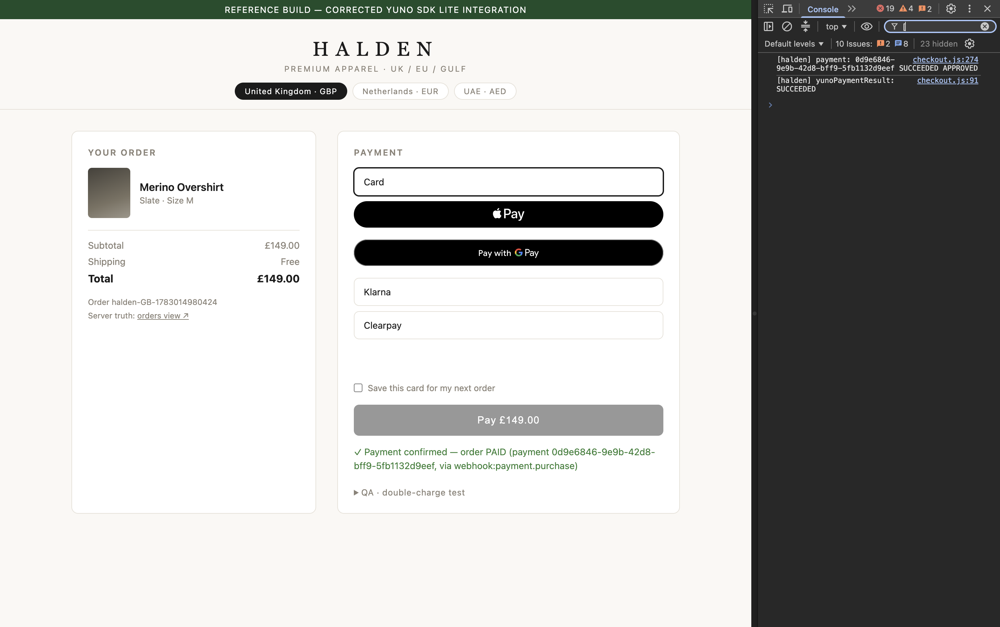
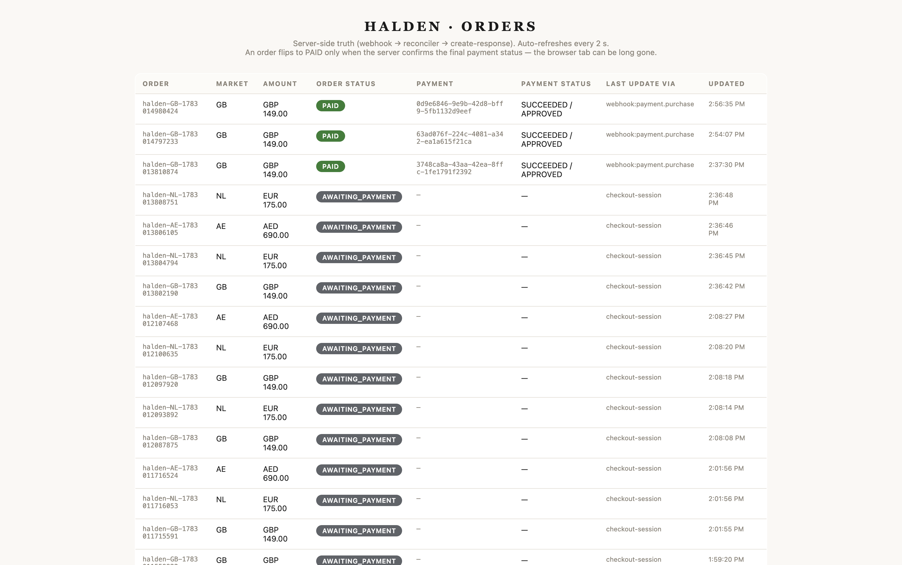
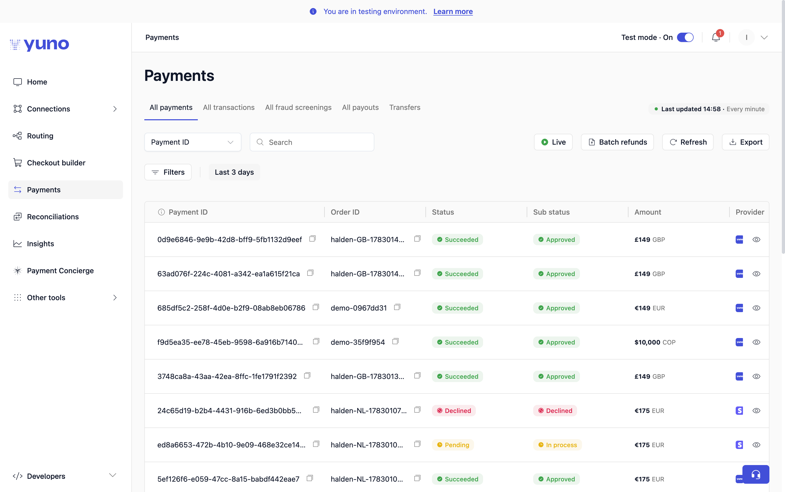
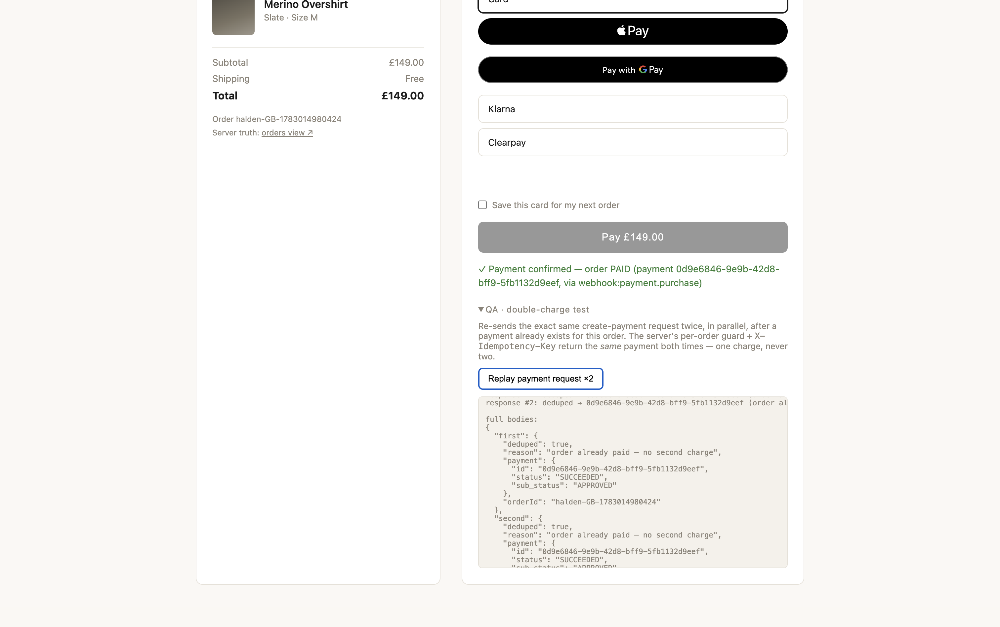
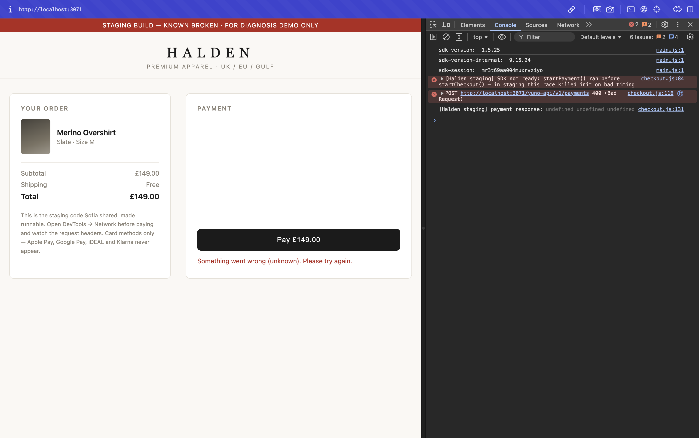

# Evidence — the three required behaviours

> Screenshots live in [`evidence/`](evidence/). Payment ids shown are sandbox objects,
> verifiable in the Yuno dashboard. Secrets are redacted in the one screenshot that
> exposed them.

## 0. The real problem — private key in the browser (the "went pale" moment)

`evidence/0-secret-key-leak.png` — the broken build's `POST /payments` request in
DevTools → Network. The **`Private-Secret-Key` header is present in a browser request**
(value redacted here; the key has been rotated). The `Public-Api-Key` right below it is
left visible on purpose — that one is *meant* to be in the browser and is the harmless
look-alike. Real leak vs. noise, in one frame.

## 1. Card payment approved end-to-end

`evidence/1-card-approved-orders-view.png` — `/orders.html` (the server-side truth) with
the order in **PAID**, the Yuno payment id, and the update source.

## 2. Async payment — pending first, paid only when it truly settles (tab closed)

Flow: pay with the 3DS challenge card (or iDEAL on the NL tab) → complete the bank step →
**close the checkout tab immediately** → the order settles server-side, from the webhook.

`evidence/2a-order-pending.png` — the order sits in **PENDING** after the tab was closed.

`evidence/2b-order-paid-via-webhook.png` — the same order flips to **PAID**, update source
`webhook:payment.purchase` — the browser was already gone.

`evidence/4-webhook-confirmation.png` — several orders confirmed **PAID via
`webhook:payment.purchase`** in the orders view: the final status always arrives on the
webhook, never from the browser.

## 3. Repeated / double-clicked payment → one charge, not two

**Broken build (control):**

`evidence/3a-buggy-two-payments.png` — Yuno Dashboard → Transactions: **two real charges**
for the same £149 cart. The staging code even mints a fresh `merchant_order_id` per click,
so nothing ties them together.

**Fixed build** — the *QA · double-charge test* panel re-sends the exact same
create-payment request twice **in parallel**:

`evidence/3b-fixed-replay-deduped.png` — both responses carry the **same payment id**
(`0d9e6846-…`), each `"deduped": true` with reason *"order already paid — no second
charge"*. One charge, never two.

## Supporting

`evidence/0b-sdk-not-ready-console.png` — the console error behind "cards work half the
time": `startPayment()` was called before `startCheckout()` (BUG #3).

**Webhook fails closed** — the endpoint verifies the HMAC signature and rejects anything
that isn't authentic (checked live with curl against the running server):

| Request | Result |
|---|---|
| no auth headers | `401` |
| correct `x-api-key`/`x-secret`, no HMAC signature | `401` |
| headers + valid `x-hmac-signature` | `200 ok` |
| tampered body with a stale signature | `401` |
