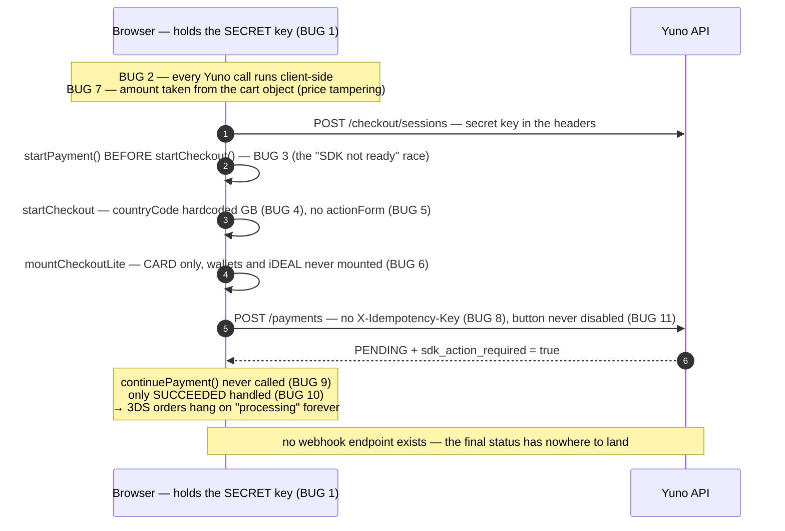
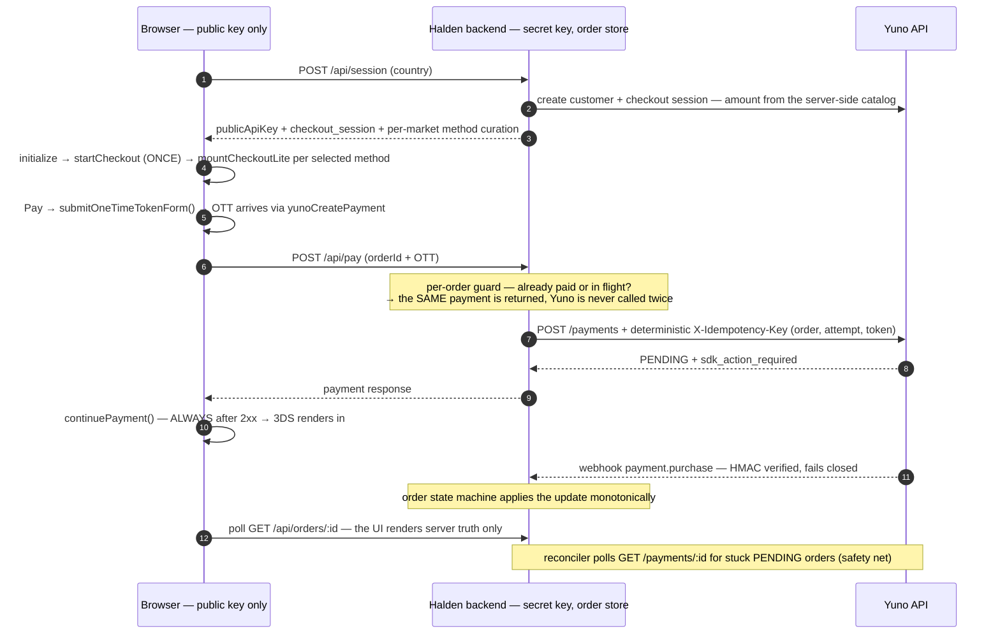
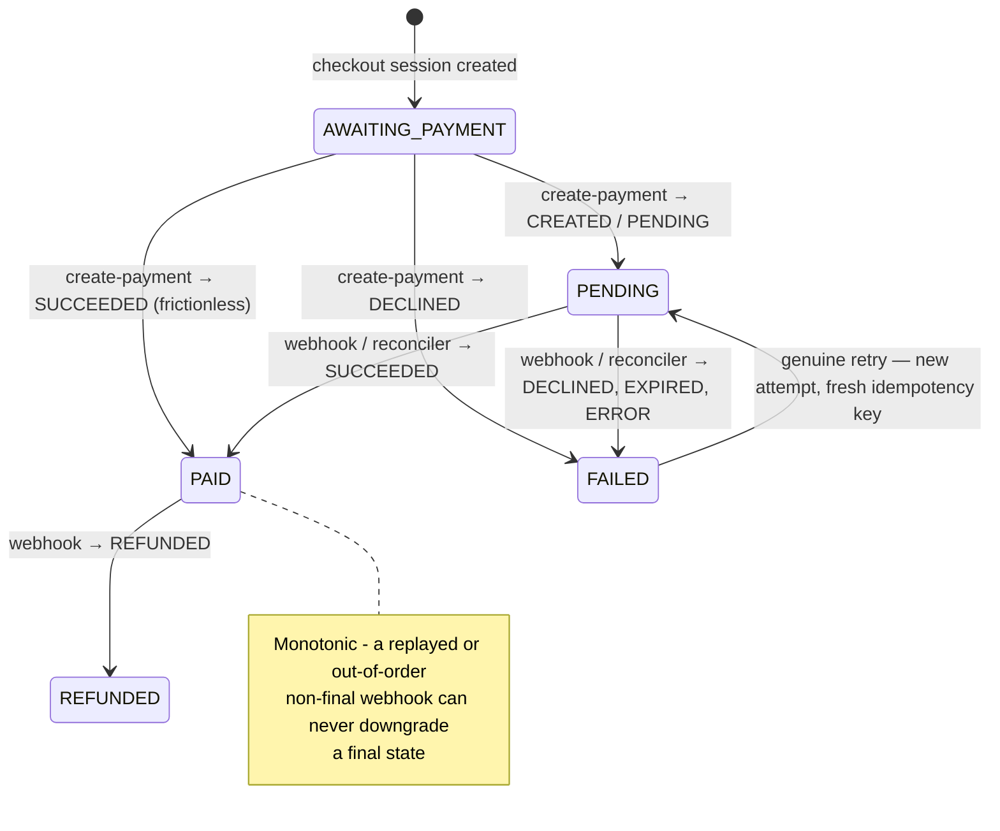
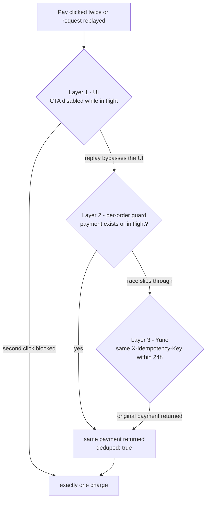

# Halden × Yuno SDK Lite — fixed checkout (SE challenge)

Halden's embedded one-page checkout on **Yuno SDK Lite (Web)**, running against the
**Yuno sandbox**. Three artifacts, one story:

| Folder | What it is |
|---|---|
| [`staging-original/`](staging-original/) | The staging code exactly as Sofia shared it — the diagnostic baseline, unmodified |
| [`buggy/`](buggy/) 🔴 | That staging code made **runnable**, every defect annotated `BUG #1…#11` — reproduces each symptom from the brief |
| [`fixed/`](fixed/) 🟢 | The corrected reference implementation: secret key server-side only, correct SDK wiring, 3DS via `continuePayment`, webhook-driven order status, guaranteed single charge |

The one-page write-up is in [WRITEUP.md](WRITEUP.md); evidence for the three required
behaviours is in [EVIDENCE.md](EVIDENCE.md).

## Run it

Requires Node 18+ (native `fetch`). Credentials from Yuno Dashboard → Developers → API keys.

```bash
cp .env.example .env         # fill in the 3 credential values; .env is gitignored
cd buggy && npm install && npm start     # → http://localhost:3071  (broken build)
cd fixed && npm install && npm start     # → http://localhost:3072  (reference build)
                                         #    server truth: http://localhost:3072/orders.html
```

**Sandbox TEST cards** (not real PANs; behaviour depends on the provider your CARD route
hits — check `transactions.provider_id` in the payment response. Any future expiry, CVV `123`):

| Test PAN (example value) | Works on | Behaviour |
|---|---|---|
| test card `4111 1111 1111 1111` | most sandbox providers | approved |
| test card `4916 9940 6425 2017` | Yuno Test Payment Gateway | **3DS browser challenge**, OTP `1234` → approved |
| test card `4000 0000 0000 0002` | Stripe | declined |

## Dashboard prerequisites (sandbox)

1. **Connections** — a provider connection for CARD (for deterministic 3DS testing connect
   the *Yuno Test Payment Gateway* with the *3D Secure credentials* checkbox).
2. **Routing** — a published route for each method (put the Test Gateway first on the CARD
   route for the 3DS demo; real providers can stay as fallback steps).
3. **Webhooks** — Developers → Webhooks → Add webhook pointing at
   `https://<public-host>/api/webhooks/yuno` (locally: `ngrok http 3072`), events `payment.*`,
   HMAC Authentication enabled. Put the same HMAC secret and the form's `x-api-key`/`x-secret`
   values into `.env` (`YUNO_WEBHOOK_SECRET`, `X_API_KEY`, `X_SECRET_KEY`).

The webhook endpoint **fails closed** (missing/invalid signature → 401). Without a public
tunnel the built-in **reconciler** polls `GET /v1/payments/{id}` every 30 s for pending
orders — same server-side truth, pulled instead of pushed; in production it stays as a
safety net *behind* the webhook.

## The three required behaviours (how to reproduce)

1. **Card approved end-to-end** — fixed build → pay with the approved test card → the order
   flips to *PAID* on the checkout **and** in `/orders.html` (payment id shown; the server
   log prints `[order] … → PAID`).
2. **Async payment settles correctly even if the tab closes** — pay with the 3DS challenge
   card (or iDEAL on the Netherlands tab), complete the bank step, **close the checkout tab
   immediately** → the order stays *PENDING* until the webhook/reconciler lands the final
   status → `/orders.html` shows *PAID* with the update source (`webhook:…` / `reconcile:…`).
3. **Double-click = one charge** — buggy build: click *Pay*, wait ~1 s, click again → two
   distinct payment ids for one order (visible in Dashboard → Transactions). Fixed build:
   *QA · double-charge test* panel → **Replay payment request ×2** → both parallel responses
   return the **same** payment id (`deduped`); exactly one charge exists.

## What was broken — the staging flow

Every numbered note is a `BUG #n` annotation you can find verbatim in [`buggy/`](buggy/):



> A subtlety the diagram hides: this architecture **cannot even run in a real browser** —
> the CORS preflight of `api-sandbox.y.uno` refuses the `private-secret-key` header, so
> every direct call dies before leaving the browser. The runnable [`buggy/`](buggy/) build
> adds a same-origin pass-through proxy purely so the broken design (and the leak in
> DevTools) can be demonstrated. Staging "kinda worked" only because something similar
> must have been in place there too.

## How it was fixed — the reference flow



### The order state machine (server-side truth)



### Why a double-click can never charge twice



## Bug map — symptom → cause → fix

| # | Bug (annotated in `buggy/`) | Symptom from the brief | Fix (in `fixed/`) |
|---|---|---|---|
| 1–2 | **Private secret key in the browser**; all Yuno calls made client-side | Security lead "went pale" in the Network tab | All Yuno calls server-side; the browser receives the **public key only** (`POST /api/session`) |
| 3 | `startPayment()` called during init, **before** `startCheckout()` | Cards work ~50%, console error "SDK not ready" | Correct order: `initialize → startCheckout (once) → mountCheckoutLite`; tokenization triggered from the Pay click via `submitOneTimeTokenForm()` |
| 4 | `countryCode: 'GB'` hardcoded | iDEAL (NL-only) can never appear | Country comes from the cart; a market switcher creates a new session per country |
| 5 | No `renderMode`/`actionForm` | Nowhere for a 3DS challenge to render | `renderMode.elementSelector.actionForm = '#yuno-action-form'` |
| 6 | Only `CARD` ever mounted | Apple Pay / Google Pay / iDEAL / Klarna never show | Method list = account's enabled methods (`GET /checkout/sessions/{id}/payment-methods`) ∩ per-market curation; wallets via `mountExternalButtons` (HTTPS) |
| 7 | Amount taken from the client | Price tampering possible | `POST /api/pay` prices the order from the server-side catalog |
| 8 | **No `X-Idempotency-Key`** | QA's duplicate charge on double-click | Deterministic key per (order, attempt, token) + server-side per-order guard + disabled CTA |
| 9 | **`continuePayment()` never called** | European cards hang on "processing" after the bank popup | `continuePayment({showPaymentStatus:false})` **always** after a 2xx create-payment |
| 10 | Only synchronous `SUCCEEDED` handled; no webhook endpoint | Async methods stuck forever | Order state machine `AWAITING_PAYMENT → PENDING → PAID/FAILED` driven by **HMAC-verified webhook** + reconciler; the UI polls server truth |
| 11 | Pay button never disabled | Second click → second tokenization → second payment | CTA disabled while in flight (UX layer; the server guard is the guarantee) |

**The harmless alarming thing:** the `public-api-key` visible in browser requests. That's
by design — the public key initializes the SDK; only the *private* key is a leak (and the
leaked staging key must be rotated).

## Hardening beyond the obvious bugs

Fixing the brief's eleven defects is table stakes. These are the failure modes that only
surface under adversarial review — each one is implemented in [`fixed/`](fixed/):

| Hardening | The failure it prevents |
|---|---|
| **Webhook fails closed** (`401` without a valid `x-hmac-signature`; static `x-api-key`/`x-secret` as an extra layer; constant-time compares) | An internet-reachable (ngrok'd) endpoint accepting **unsigned** requests would let anyone flip any order to PAID |
| **Monotonic order state machine** | A replayed or out-of-order webhook carrying a non-final status would downgrade a PAID order back to PENDING |
| **Idempotency key bound to (order, attempt, token)** — not a random UUID per request | Random keys don't dedupe double-clicks at all; a key without the token would wrongly swallow a *genuine* retry after a declined attempt |
| **In-flight flag is process-lifetime only** (reset on restart, never trusted from disk) | A crash mid-payment would otherwise deadlock the order forever — every later attempt "deduped" against a payment that may not exist |
| **Server-side pricing** (amount from the catalog, never the request body) | The staging pattern let the client pay £0.01 for any order |
| **Per-market method curation ∩ account list** | The sandbox account is configured globally — without curation a UK checkout renders PIX, KakaoPay and 7-Eleven; with only curation (no live list) it would render methods the account can't process |
| **Orders API redacts internals** (`vaulted_token`, `customer_id`, session) + orders view escapes webhook-derived strings | Vault-token references shipped to any browser; stored XSS via a forged webhook payload |
| **Sandbox-only gate** (refuses to boot with `YUNO_ENVIRONMENT=production`) | A demo repo must not be one env-var away from hitting production |
| **CTA watchdog** (button re-enables when tokenization fails to start a payment) | Inline card-validation failure would leave the Pay button dead until a page reload |
| **CORS reality check** (buggy build ships a same-origin proxy) | The browser preflight silently blocks the `private-secret-key` header cross-origin — without knowing this, the "broken" build can't even reproduce the symptoms it's meant to demonstrate |
| **SDK quirk pinned down**: `startPayment()` before `startCheckout()` *resolves silently* in SDK v1.5 | The brief's "SDK not ready" console error doesn't reproduce by itself — the buggy build logs it deterministically on both outcomes so the race is demonstrable on video |

## Key decisions

- **SDK Lite is the right choice.** Embedded one-page checkout with per-method control is
  exactly its niche; every failure was wiring, not SDK selection. Switching SDKs days
  before launch would add risk, not remove it.
- **Order status is always correct** because the browser is never trusted: the server owns
  the order state machine, updated by signed webhooks (primary) and a reconciler
  (fallback); the UI just renders it. Correct even if the shopper closes the tab mid-3DS.
- **Single charge by construction:** per-order in-flight guard (duplicates never reach
  Yuno) → deterministic `X-Idempotency-Key` (Yuno returns the original payment for any
  retry — keys stored 24 h) → disabled CTA.
- **Card saving / Q2 subscriptions:** "save card" sets `vault_on_success: true`; the
  vaulted token + `stored_credentials` (CIT/MIT) is the documented path to subscriptions.

## Go-live call

**Conditional GO for Monday.** All defects are diagnosed and fixed in this reference:
keys server-side (the staging key is considered leaked — rotate it), webhook + idempotency
in place. Apple Pay needs Apple domain verification — an external dependency: launch
without it and fast-follow. For finance: *yes, double charges were possible — QA proved
it; after the fix a duplicate request provably returns the same single payment.*
